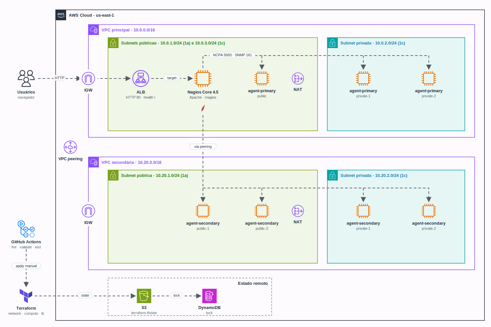

<h1 align="center">
  GS2 - Monitoramento com Nagios Core na AWS com Terraform
</h1>

<p align="center">
  <a href="https://skillicons.dev">
    
  </a>
</p>

## Qual a finalidade do projeto?

Global Solution 2 da disciplina de **Infraestrutura como Código** (FIAP, 2024). O objetivo é montar, só com **Terraform**, um laboratório de **gerenciamento e monitoramento de servidores com o Nagios Core** na AWS.

O código é **modular**: um módulo cria a rede (duas VPCs ligadas por peering, subnets públicas e privadas, NAT e rotas), outro cria as instâncias EC2 (o servidor Nagios Core e sete agentes) e o terceiro cria o **Application Load Balancer** que publica a interface web do Nagios. Um arquivo orquestrador liga os três módulos.

A instalação do software acontece no boot das instâncias, por **user-data**: o servidor compila o Nagios Core e os plugins a partir do código-fonte, e os agentes instalam o **NCPA** e o **SNMP**. O estado do Terraform fica num bucket **S3** com lock no **DynamoDB**, e o GitHub Actions valida tudo a cada push.

## Arquitetura

<p align="center">
  
</p>

## O que foi construído

### Módulos

| Módulo | Recursos |
|---|---|
| `network` | 2 VPCs, VPC peering, 2 internet gateways, 5 subnets (3 públicas e 2 privadas), 2 NAT gateways com Elastic IP, 4 tabelas de rotas e as associações |
| `compute` | 4 security groups, a AMI do Amazon Linux 2 (data source), o servidor Nagios Core e 7 agentes (`for_each`) |
| `lb` | Application Load Balancer, security group do ALB, target group com health check e listener HTTP |

Ao todo são **40 recursos**.

### Rede

| VPC | CIDR | Subnets |
|---|---|---|
| Principal | `10.0.0.0/16` | públicas `10.0.1.0/24` (1a) e `10.0.3.0/24` (1c, segunda zona exigida pelo ALB) · privada `10.0.2.0/24` (1c) |
| Secundária | `10.20.0.0/16` | pública `10.20.1.0/24` (1a) · privada `10.20.2.0/24` (1c) |

As subnets públicas saem pelo internet gateway e as privadas pelo NAT gateway da sua VPC. As quatro tabelas de rotas têm rota para a outra VPC pelo peering, então o Nagios alcança todos os agentes.

### Instâncias

| Nome | Subnet | O que roda |
|---|---|---|
| `nagios-core` | pública da VPC principal | Nagios Core 4.5.2, Nagios Plugins 2.4.6, Apache e PHP |
| `agent-primary-public` | pública da VPC principal | NCPA e SNMP |
| `agent-primary-private-1` e `-2` | privada da VPC principal | NCPA e SNMP |
| `agent-secondary-public-1` e `-2` | pública da VPC secundária | NCPA e SNMP |
| `agent-secondary-private-1` e `-2` | privada da VPC secundária | NCPA e SNMP |

Todas usam Amazon Linux 2 (`t2.micro` e key pair `vockey` por padrão, os do AWS Academy).

### Segurança

| Ponto | Como foi resolvido |
|---|---|
| Senha do Nagios | Variável `nagios_admin_password` sensível, sem valor padrão e com no mínimo 12 caracteres; a senha padrão `nagiosadmin` não é usada |
| SNMP | Community da variável `snmp_community` (sensível), só leitura e aceita apenas a partir da VPC do Nagios |
| SSH | Liberado só para as faixas de `allowed_ssh_cidrs` |
| Entre as VPCs | Tráfego liberado apenas entre `10.0.0.0/16` e `10.20.0.0/16` |
| ALB | Recebe HTTP da internet e só fala com a VPC principal na porta 80 |
| Estado | Backend S3 com `encrypt = true` e lock no DynamoDB; nome do bucket e da tabela fora do código (`backend.hcl`) |

### Variáveis

| Variável | Padrão | Descrição |
|---|---|---|
| `nagios_admin_password` | obrigatória | Senha do `nagiosadmin` na interface web |
| `snmp_community` | obrigatória | Community SNMP dos agentes |
| `allowed_ssh_cidrs` | `["0.0.0.0/0"]` | Faixas liberadas no SSH (restrinja ao seu IP) |
| `aws_region` | `us-east-1` | Região |
| `availability_zones` | `["us-east-1a", "us-east-1c"]` | Zona das subnets públicas e das privadas |
| `instance_type` | `t2.micro` | Tipo das instâncias |
| `key_name` | `vockey` | Key pair do SSH |
| `project_name` | `fiap-iac-gs2` | Prefixo dos nomes e tag `Project` |
| CIDRs das VPCs e subnets | tabela de rede acima | `primary_vpc_cidr`, `secondary_vpc_cidr` e as subnets |

### Saídas

| Saída | Conteúdo |
|---|---|
| `nagios_url` | `http://<DNS do ALB>/nagios` |
| `alb_dns_name` | DNS público do ALB |
| `nagios_direct_url` | URL do Nagios direto no IP público da instância |
| `nagios_core_public_ip` | IP público do servidor |
| `agent_private_ips` | IP privado de cada agente, para cadastrar os hosts no Nagios |

### Pipelines (GitHub Actions)

| Workflow | Quando roda | O que faz |
|---|---|---|
| `terraform-ci.yml` | push na `main`, pull request e manual | `fmt -check`, `init -backend=false`, `validate`, `terraform test` e o teste do user-data, sem nenhuma credencial |
| `terraform-deploy.yml` | só manual (`workflow_dispatch`) | `plan`, `apply` ou `destroy` com as credenciais da AWS, o backend e as senhas vindos de *secrets* |

## Tecnologias utilizadas

- **Terraform 1.9** com o provider **AWS**: módulos, `for_each`, `templatefile()`, validações e `terraform test` com provider simulado;
- **AWS:** VPC, subnets, internet e NAT gateways, VPC peering, EC2, Application Load Balancer, S3 e DynamoDB;
- **Nagios Core 4.5.2 + Nagios Plugins 2.4.6:** servidor de monitoramento, compilado no boot;
- **NCPA e net-snmp:** agentes nas instâncias monitoradas;
- **Bash:** scripts de user-data e o teste deles;
- **Docker:** roda os testes (Terraform e Amazon Linux 2) sem instalar nada;
- **GitHub Actions:** validação contínua e deploy manual.

## Estrutura do repositório

```text
fiap-iac-gs2/
├── terraform/
│   ├── main.tf                   # Orquestrador: liga network, compute e lb
│   ├── variables.tf              # Variáveis da raiz (senhas, CIDRs, região, instâncias)
│   ├── outputs.tf                # URL do Nagios, DNS do ALB e IPs dos agentes
│   ├── providers.tf              # Provider AWS, tags padrão e backend S3 parcial
│   ├── backend.hcl.example       # Bucket, chave, região e tabela de lock (copie para backend.hcl)
│   ├── terraform.tfvars.example  # Variáveis obrigatórias (copie para terraform.tfvars)
│   ├── modules/
│   │   ├── network/              # VPCs, peering, subnets, NAT e rotas
│   │   ├── compute/              # Security groups, Nagios Core e agentes
│   │   │   └── scripts/          # user-data: nagios-core.sh e nagios-agent.sh
│   │   └── lb/                   # ALB, target group e listener
│   └── tests/nagios.tftest.hcl   # terraform test com provider simulado
├── tests/user-data.sh            # Roda os user-data num container Amazon Linux 2
├── .github/workflows/            # CI (sem credenciais) e deploy manual
└── docs/arch.gif                 # Diagrama
```

## Fluxo de funcionamento

1. O `terraform apply` cria a rede, as instâncias e o ALB, e grava o estado no S3 com lock no DynamoDB.
2. No boot, o `nagios-core.sh` instala as dependências, compila o Nagios Core e os plugins, cria o usuário `nagiosadmin` com a senha da variável e sobe o Apache e o Nagios.
3. O `nagios-agent.sh` instala o NCPA e o net-snmp em cada agente e libera a community SNMP só para a VPC do Nagios.
4. O ALB passa a encaminhar para o Nagios Core quando o health check em `/` responde 200.
5. O usuário abre `nagios_url`, faz login com `nagiosadmin` e acompanha os hosts. Os agentes são cadastrados manualmente no Nagios com os IPs de `agent_private_ips` (NCPA na porta 5693, SNMP na 161), inclusive os da VPC secundária, pelo peering.

## Como rodar

Pré-requisitos: Terraform 1.7 ou mais novo (o `terraform test` com provider simulado precisa dele) ou Docker, credenciais da AWS (no AWS Academy, as do *AWS Details*), um bucket S3 e uma tabela do DynamoDB com chave de partição `LockID` (String) para o estado.

```bash
cd terraform
cp backend.hcl.example backend.hcl                 # bucket e tabela de lock
cp terraform.tfvars.example terraform.tfvars       # senha do Nagios, community SNMP e seu IP
terraform init -backend-config=backend.hcl
terraform plan
terraform apply
terraform output nagios_url
```

A compilação do Nagios leva alguns minutos depois que a instância sobe. Para apagar tudo: `terraform destroy`.

Pelo GitHub Actions: cadastre os *secrets* listados no topo de `terraform-deploy.yml` (credenciais da AWS, bucket, tabela, senha e community) e rode **Actions > Terraform deploy (manual) > Run workflow** escolhendo `plan`, `apply` ou `destroy`.

## Como validar a entrega

Tudo abaixo roda sem conta na AWS:

```bash
cd terraform
terraform fmt -check -recursive
terraform init -backend=false
terraform validate
terraform test                  # 4 cenários com provider simulado
cd ..
bash tests/user-data.sh         # user-data num container Amazon Linux 2 (uns 5 minutos)
```

Sem Terraform instalado, troque `terraform` por `docker run --rm -v "$PWD":/w -w /w hashicorp/terraform:1.9`.

O `terraform test` confere:

- rotas do peering entre as duas VPCs e as duas subnets públicas do ALB em zonas diferentes;
- 7 agentes, o Nagios Core na subnet pública e o user-data com a senha e a community das variáveis;
- SSH liberado só para `allowed_ssh_cidrs`;
- senha com menos de 12 caracteres recusada;
- a stack inteira aplicada com o provider simulado, com a URL do Nagios apontando para o ALB.

O `tests/user-data.sh` confere, com o Nagios rodando de verdade no container:

- NCPA e net-snmp instalados nos agentes e a community SNMP restrita à VPC do Nagios;
- Nagios Core compilado, `nagios -v` sem erros e os plugins instalados;
- `/` respondendo 200 (health check do ALB), `/nagios` pedindo login, a senha padrão recusada e a senha da variável aceita.

O `terraform apply` na AWS não faz parte dessa validação: ele precisa de uma conta e cria recursos pagos (NAT gateways e ALB).

---

## Autor

**William Coelho** · RM 556336 · [@willtechdev](https://github.com/willtechdev)
